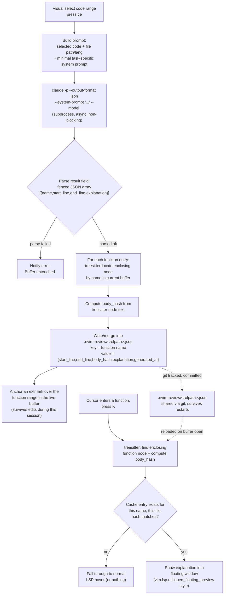

# review-explain.nvim — on-demand AI code explanation (MVP design)

## Background

Extensive brainstorming session (2026-08-24) explored integrating Claude Code
into Neovim for AI-assisted review of code Claude writes elsewhere (via
Claude Remote Control, running in a local tmux session). Rejected paths and
why, in order:

1. **claudecode.nvim** (`coder/claudecode.nvim`) — unofficial reverse-engineered
   WebSocket/MCP IDE-extension client. Diff view conflicted with the file
   explorer plugin and felt unstable/ugly. Beta status, single maintainer.
2. **tmux attach to the live Remote Control session** — technically simple,
   but delivers no more value than the Remote Control app already gives
   (shared input stream, `window-size latest` forces disruptive pane resizes
   between clients), and none of the structured IDE-integration value
   (selection sync, in-buffer diff, caller-impact awareness).
3. **CodeCompanion.nvim + ACP (`claude-agent-acp`)** — standardized Agent
   Client Protocol, actively maintained. Blocked: Anthropic's Feb 2026 policy
   explicitly forbids using consumer (Free/Pro/Max) OAuth tokens with
   anything other than Claude Code and claude.ai, **including the Agent
   SDK** — which `claude-agent-acp` wraps. Using it would either violate ToS
   (OAuth) or require separate pay-per-token billing (`ANTHROPIC_API_KEY`).
   Confirmed by reproducing a `401 Invalid bearer token` error live.
4. **Split nvim-side agent + `SendMessage`/`ListAgents` to the main research
   session** — real value (context isolation, non-blocking parallelism) but
   does not deliver the originally-wanted "watch the same session" pairing
   experience, and reintroduces the same cross-agent coordination cost the
   whole exercise was trying to avoid.

**Converging insight:** nvim does not need a live Claude session at all.
Claude already writes code elsewhere (Remote Control / tmux). Once that code
lands as files, review is a **git + LSP + treesitter** problem, not an
IDE-protocol problem. Where Claude *does* add value is answering the one
question those tools can't: "I don't understand this code — explain it,"
asked on demand.

Further narrowing: diff-level summaries and risk flags were considered and
rejected as plugin features — that responsibility belongs to good commit
hygiene (already required by this user's global CLAUDE.md: Conventional
Commits, small reviewable diffs). The plugin's only AI-costing operation is
this MVP: **on-demand, per-function code explanation**, invoked purely by
human confusion, never automatically.

## Goal

Select a code range → Claude explains it, segmented per function → cached →
instantly re-viewable by placing the cursor in an explained function.

## Non-goals (MVP)

- No diff summarization, no risk flagging (commit-message responsibility).
- No auto-generation on hover — explanation is only ever created by an
  explicit selection + trigger.
- No auto-refresh when cached explanation goes stale — a hash mismatch means
  "no cache," not "silently re-query" (avoids surprise API/rate-limit use).
- No multi-file batch processing.
- No embedded/live Claude session, no ACP, no OAuth-token reuse outside the
  official `claude` CLI itself.

## Authentication constraint (load-bearing)

All AI calls MUST go through the official `claude` CLI binary in
non-interactive print mode (`claude -p ...`), never the Agent SDK directly.
This is the only mechanism that stays within Anthropic's Feb 2026 ToS while
still drawing on subscription quota (not pay-per-token billing). Verified
live: `claude -p "..." --output-format json` returns a JSON envelope whose
`total_cost_usd` is a notional/informational figure (what it would cost at
API list rates) — actual billing is the flat subscription; the number is
useful only as a proxy for how much of the subscription's rate-limit budget
a call consumes.

## Workflow



Two independent entry points share one storage format:

- **Generate** (top half): explicit, human-triggered, costs an AI call.
- **Recall** (bottom half): implicit, cost-free, pure local lookup.

## Components

### 1. Trigger & prompt construction
- Keymap: visual mode `<leader>ce` (placeholder — must be checked against the
  live keymap table the way `<leader>gv`/`<leader>gl` were, per the
  diffview.nvim collision found and fixed earlier this session).
- Prompt: selected text + file path + filetype, wrapped in a **minimal,
  task-specific system prompt** (via `claude -p --system-prompt`) — not the
  user's full CLAUDE.md — instructing Claude to:
  - identify each top-level function/method in the selection,
  - return *only* a fenced JSON array: `[{name, start_line, end_line,
    explanation}]`,
  - keep each `explanation` to 2–4 concise sentences, no code repetition.
- Model: a lighter/faster tier by default (exact choice deferred to
  implementation — needs the empirical validation called out below).

### 2. Async execution
- `vim.system({"claude", "-p", ..., "--output-format", "json"}, {}, callback)`
  — never blocks the editor. Show a lightweight in-progress indicator (reuse
  `snacks.nvim`'s notifier, already installed) while waiting.

### 3. Response parsing
- Extract the `result` field from the JSON envelope.
- Extract the fenced JSON block from `result`, `vim.json.decode` it.
- On any failure (no fence, invalid JSON, wrong shape): notify the user with
  the raw text and abort. Never partially apply.

### 4. Position resolution — line numbers are hints, not truth
- Stored `start_line`/`end_line` are only an initial hint for locating the
  node the first time.
- On every load/lookup, treesitter searches the *current* buffer for a
  function node matching the cached name; if ambiguous (overloads, same name
  in multiple scopes), disambiguate by matching `body_hash`.
- This is what keeps the cache correct even when unrelated edits shift line
  numbers elsewhere in the file, and is also what makes the same cache
  entries resolve correctly when the equivalent function is opened inside a
  `diffview.nvim` buffer showing a different commit (different line
  universe, but the same name — and a different `body_hash` if the function
  actually changed at that revision, which is the correct behavior: old and
  new versions get distinct cache entries).

### 5. Cache storage
- Path: `.nvim-review/<relative-file-path>.json`, git-tracked (explanations
  are meant to accumulate like durable, code-attached documentation, per
  the "AI-generated dynamic comments" framing agreed on earlier).
- Shape:
  ```json
  {
    "calculate_reward": {
      "start_line": 42,
      "end_line": 58,
      "body_hash": "sha256:...",
      "explanation": "...",
      "generated_at": "2026-08-24T12:00:00+09:00"
    }
  }
  ```

### 6. Live-session anchoring
- After a successful generate (or a successful cache-hit lookup), place an
  `nvim_buf_set_extmark` over the resolved range so within-session edits
  don't require re-running treesitter search on every keystroke — extmarks
  track position automatically, the same mechanism gitsigns/LSP diagnostics
  already rely on in this config.

### 7. Recall / display
- `K` inside a function with a valid (hash-matching) cache entry shows the
  explanation via the same floating-window styling as LSP hover
  (`vim.lsp.util.open_floating_preview`), so it reads as a natural extension
  of existing hover muscle memory rather than a new UI paradigm.
- No cache entry → fall through to whatever `K` already does (LSP hover, if
  any).

## Open questions / needs empirical validation

- **Prompt quality is unverified.** What "good explanation" output looks
  like, and whether Claude reliably returns clean, parseable JSON for this
  task, is unknown until tried. Per this user's own `experiment-transparency`
  conventions: start at *probe* tier (quick manual trials of a few prompt
  variants against real code, no formal process) before hardening the
  prompt into the shipped default.
- **Model choice** for the generate call (cost/latency vs. quality) is
  deferred to the same probe-tier validation.
- **Exact keymap** (`<leader>ce` is a placeholder) must be checked for
  collisions the same way the diffview.nvim keymaps were, before binding.

## Explicitly out of scope, revisit later if needed

- Auto re-generation when a cached explanation goes stale.
- Semantic sub-function segmentation (splitting one function into multiple
  explained chunks) — the per-function granularity is the MVP's ceiling.
- Any live/embedded Claude session inside nvim.
